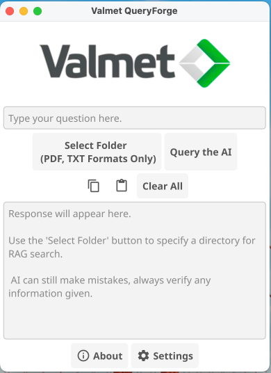
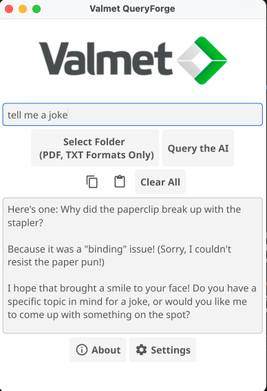

<div align="center">
  
# 
# QueryForge
#### Produced by [VII @ Valmet](https://www.valmet.com/automation/industrial-internet/)


<div style="display: flex; align-items: center; gap: 10px;">

<a href="https://ollama.ai">
  
</a>

<a href="https://www.gnu.org/licenses/gpl-3.0">
  
</a>

</div>


### A lightweight, yet robust, private local AI RAG chat application for Ollama - designed for conversations involving sensitive data.
___
</div>

## 📖 Table of Contents:
* [Project Background](#-project-background)
* [Screenshots](#-screenshots)
* [How to Run](#-how-to-run)
* [Building From Source](#%EF%B8%8F-building-from-source-advanced-users-only)

---

## 🤓 Project Background
QueryForge is a lightweight, secure, and efficient local AI-driven RAG (Retrieval Augmented Generation) chat application designed specifically for conversations involving sensitive data. Built entirely in the Go programming language, QueryForge offers a robust, easy-to-use interface for querying a local AI model (on Ollama) without relying on cloud-based services, ensuring privacy and security for users dealing with confidential information.

This project was developed by [Valmet of North America](https://www.valmet.com), under the [Valmet Industrial Internet](https://www.valmet.com/automation/industrial-internet/) division. Valmet is an international automation and services company that specializes in providing solutions to industries such as pulp, paper, and energy. With a strong focus on advancing sustainable practices, Valmet offers a range of technologies and services aimed at improving operational efficiency and environmental performance. Our expertise spans from process automation to machine vision systems, and we work with clients globally to implement cutting-edge solutions that drive innovation forward.

Valmet’s commitment to integrating advanced technologies, such as artificial intelligence, with traditional industries allows them to support customers in transforming their operations. The development of QueryForge is part of Valmet's ongoing efforts to explore new frontiers in automation and AI applications, particularly in sectors that require high levels of data privacy and security. By focusing on local, private AI-driven solutions, Valmet aims to provide businesses with powerful tools for managing sensitive data while maintaining complete control over the information flow.

This project utilizes direct injection for all user queries, ensuring that no data is sent to external servers or stored in the cloud. By keeping all operations local, QueryForge provides a secure environment for conducting conversations that involve confidential information. The application's intuitive interface, combined with its customizable AI model selection, makes it easy for users to interact with the AI and receive accurate, relevant responses quickly. With features such as progress feedback, clipboard integration, and folder selection, QueryForge offers a seamless user experience that prioritizes efficiency and privacy.

#### Valmet of North America is based in Atlanta, Georgia, and is part of the broader Valmet global network, which itself spans over 30 countries worldwide.
___

### Features:
- Private and Local: All operations occur entirely on the local machine, ensuring sensitive data remains private.
- Customizable AI Model: Select from different base conversational and embedding models to fine-tune the AI's responses.
- Easy Folder Selection: Choose a directory for running the RAG search, streamlining the process of retrieving relevant documents for AI-based responses.
- Progress Feedback: A progress bar indicates the status of queries, giving users visibility into processing times.
- Clipboard Integration: Copy and paste functionality is available directly from the toolbar, enhancing usability.
- Simple Interface: Designed with an intuitive cross platform Fyne-based GUI for seamless interaction.

### Underlying Code
The core application is written in Go and utilizes the Fyne GUI framework for creating a cross-platform desktop application. Here's an overview of some key components:
- Fyne Framework: Used for creating the UI elements - it also ensures cross-platform compatibility.
- Effortless AI Model Integration: The application queries an AI model in Ollama, which processes the input text and retrieves relevant responses. This keeps things simple for the end user, since Ollama handles model management - no AI interfacing is done manually by the user.
- Folder Selection: Users can select a folder to run the RAG search, our direct injection process for document handling gets you an asnwer quickly.
- Settings and Model Selection: The app allows users to select base conversational mmodels to customize the AI's behavior.

### Ollama Configuration
QueryForge expects that Ollama will be running on `localhost:11434`. If this is not the port for your Ollama configuration, or you if you want to connect to a remote IP - please edit the `./src/api.go` file and recompile the program using the build instructions provided below.
___

## 📸 Screenshots 
<div align="center">
  




</div>

## 🦙 How To Run

### Windows:

0. Make sure you have the latest version of Ollama installed on your machine. If you don't have Ollama, you can download it [by clicking here](https://ollama.com/). Optionally, you can use the `./setup/windows_setup.bat` script to install Ollama on your machine. 
To pull all the necessary files, you can use the following command:
```
ollama pull qwen2.5:0.5b
ollama pull llama3.2:1b
ollama pull llama3.2:3b
ollama pull phi3:3.8b
```
1. Download the latest release from the [Releases page](https://github.com/ValmetUSA/QueryForge/releases) on GitHub.
2. Extract the contents of the zip file to a folder on your computer.
3. Run the `QueryForge.exe` file to start the application.

### MacOS:
0. Make sure you have the latest version of Ollama installed on your machine. If you don't have Ollama, you can download it [by clicking here](
https://ollama.com/). Optionally, you can use the `./setup/macos_setup.sh` script to install Ollama on your machine.
To pull all the necessary files, you can use the following command:
```
ollama pull qwen2.5:0.5b
ollama pull llama3.2:1b
ollama pull llama3.2:3b
ollama pull phi3:3.8b
```
1. Download the latest release from the [Releases page](https://github.com/ValmetUSA/QueryForge/releases) on GitHub.
2. Extract the contents of the zip file to a folder on your computer.
3. Run the `QueryForge` file to start the application.

### Linux:
0. Make sure you have the latest version of Ollama installed on your machine. If you don't have Ollama, you can download it [by clicking here](
https://ollama.com/). Optionally, you can use the `./setup/linux_setup.sh` script to install Ollama on your machine.
To pull all the necessary files, you can use the following command:
```
ollama pull qwen2.5:0.5b
ollama pull llama3.2:1b
ollama pull llama3.2:3b
ollama pull phi3:3.8b
```
1. Download the latest release from the [Releases page](https://github.com/ValmetUSA/QueryForge/releases) on GitHub.
2. Extract the contents of the zip file to a folder on your computer.
3. Run the `QueryForge` file to start the application.

____

## 👷‍♂️ Building From Source (Advanced Users Only!)
> [!IMPORTANT]
> Before you start - make sure you have the [GoLang compiler downloaded and installed for your operating system](https://go.dev/doc/install)!

1. Clone this git repo, either by running the command below or [downloading the repo as a zip archive](https://github.com/ValmetUSA/QueryForge/archive/refs/heads/main.zip):
   ```
   git clone https://github.com/ValmetUSA/QueryForge.git
   ```
2. Use the `cd` command to naviagate to the directory containing QueryForge (likely your home directory), and download all build dependencies by running the command below:
   ```
   go mod download
   ```

3. Run the following command to build an executable for your operating system:
  ```
  go build ./src/
  ```

4. Run the following command to run the program directly from source:
  ```
  go run ./src/
  ```

5 (Optional). If you want a single executable file, you can use the makefile to build the executable:
  ```
  make "YOUR_OS"
  ```
  > [!TIP]
  > Replace "YOUR_OS" with your operating system (e.g. "windows", "linux", "macos"). 
  > This will create a single executable file for your OS.
  > This might also fix some issues with the Fyne framework not being able to find the correct resources,
  > depending on how your OS is configured.
