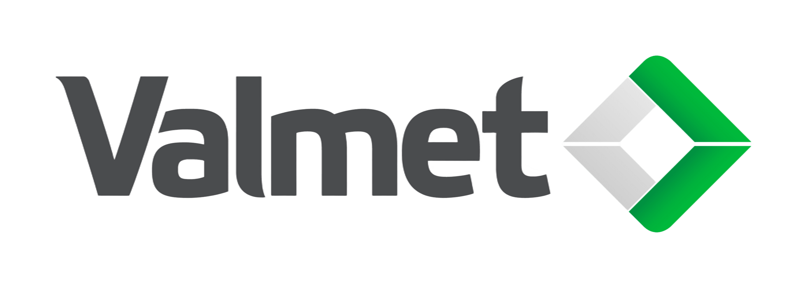

# QueryForge 
___
Produced by: [VII @ Valmet](https://www.valmet.com/automation/industrial-internet/)

### A simple, yet robust, private local AI chat application for Ollama designed for sensitive data conversations.
___

To Do (Desciption, % of entire project):
- [x] Get UI and Framework done - 30%
- [x] Add RAG - 30%
- [ ] Finish file picker with RAG, along with adjustments - 10%
- [ ] Finish front end (as of recently, mostly working with a few bugs) - 20%
- [ ] Write script to setup Ollama - 5%
- [ ] Finish documentation on GitHub - 5%
